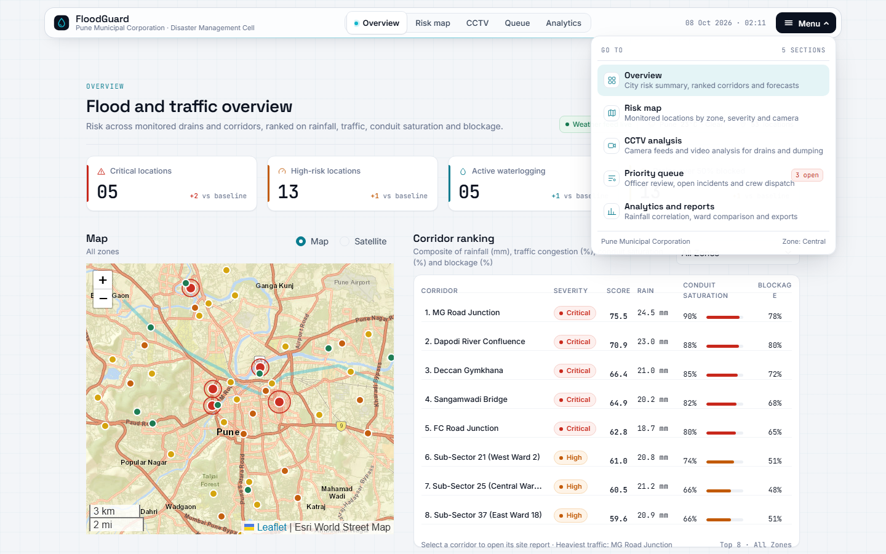
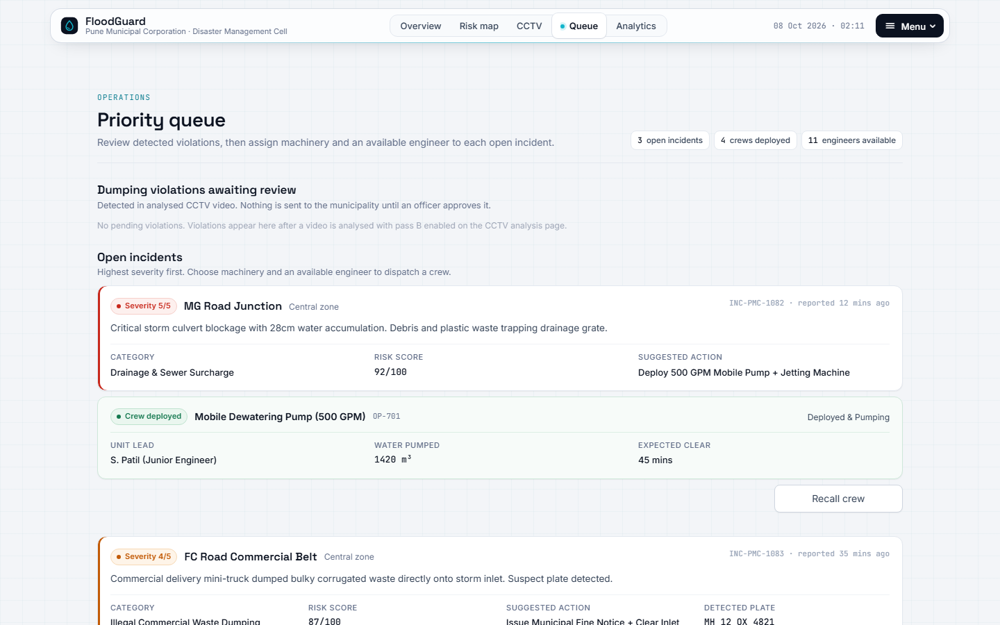

# FloodGuard

**Drain, garbage and dumping detection from street video, for the Pune Municipal Corporation.**

Built for the KCC Hackathon. Upload a CCTV, phone or drone clip, and FloodGuard:

- finds blocked drains, open manholes, garbage heaps, potholes and waterlogging;
- outlines and tracks every object frame by frame, and measures how much of the scene is garbage, by waste stream;
- scores drainage and garbage risk with transparent, deterministic formulas;
- catches people dumping waste, with person, vehicle and number-plate photos, and holds them for an officer's approval;
- alerts the corporation by email, Telegram or webhook.



---

## Contents

- [How it works](#how-it-works)
- [What is real and what is demo data](#what-is-real-and-what-is-demo-data)
- [Quick start](#quick-start)
- [Using it](#using-it)
- [Configuration](#configuration)
- [Project layout](#project-layout)
- [Tests](#tests)
- [Known limitations](#known-limitations)
- [Documentation](#documentation)
- [Team](#team)

---

## How it works

Two kinds of model work together, each on what it does best:

| | Gemini 3.8 Flash (cloud VLM) | YOLOE-26s-seg (local, CPU) |
|---|---|---|
| Answers | *What is happening?* | *Where is each thing, in every frame?* |
| Finds | Blocked drains, garbage, potholes, people dumping waste, number plates, drain water level | Pixel outlines and track IDs for people, vehicles, drains, potholes, plates and garbage |
| Output | Structured JSON, validated against Pydantic schemas | Masks, tracks, garbage coverage, waste-stream share |

```
video ──> Gemini Pass A: infrastructure issues ─┐
      ──> Gemini Pass C: drain condition ───────┤
      ──> Gemini Pass B: dumping violators ─────┼──> deterministic scores ──> alerts (hazards)
      ──> Gemini: mark garbage on 4 frames ──┐  │                         └─> officer review (violations)
      ──> YOLOE + BoT-SORT, every frame <────┘  └──> evidence video + result.json
```

Key ideas:

- **Gemini teaches the local detector what garbage looks like in this video.** Text prompts alone barely detect real garbage, so Gemini's boxes on four keyframes become visual prompts for YOLOE.
- **Garbage is measured as area, not counted.** Heaps have no stable outline between frames. FloodGuard reports how much of the frame is covered, and the share by waste stream (dry plastic, dry paper, wet organic, construction, e-waste, mixed).
- **The VLM never produces a score.** Gemini reports facts (water `flowing_over`, trash `heavy`). Python turns them into scores, and every score lists its inputs.
- **Nothing is invented.** If a step fails, the job fails or the field says "not measured".
- **People are never reported automatically.** Dumping evidence goes to an officer, whose name is recorded on approval or rejection.

Full details: [docs/ARCHITECTURE.md](docs/ARCHITECTURE.md).

---

## What is real and what is demo data

| Part | Source |
|---|---|
| Video analysis, evidence video, scores, objects, waste breakdown (CCTV page) | **Real** pipeline output |
| Dumping violations awaiting review (Priority queue page) | **Real**, from analysed videos |
| Alerts | **Real** when a channel is configured |
| Rainfall and forecast | **Live** from WeatherAPI |
| Traffic congestion | **Live** from TomTom (currently blocked on the dev machine by an SSL issue) |
| 53 monitored locations, camera list, open incidents, crews, corridor history | **Demo data** in `app/ui/pune_data.py` |

---

## Quick start

Requirements:

- Python 3.9 or newer (developed on 3.14);
- about 2 GB of disk for PyTorch and the model weights;
- a Gemini API key from [Google AI Studio](https://aistudio.google.com/).

```bash
git clone https://github.com/utkarshchauhan325-del/KCC-Hackathon.git
cd KCC-Hackathon
python -m venv .venv
```

Activate the environment:

```bash
source .venv/bin/activate
```

On Windows, run `.venv\Scripts\activate` instead.

Install PyTorch. Use the CPU build unless you have an NVIDIA GPU:

```bash
pip install torch torchvision --index-url https://download.pytorch.org/whl/cpu
```

Install the project and dashboard extras:

```bash
pip install -e ".[dev]"
pip install plotly folium streamlit-folium pandas
```

Configure keys:

```bash
cp .env.example .env
```

Edit `.env` and set at least `GEMINI_API_KEY`. Set `GEMINI_MODEL=gemini-3.8-flash` if your key has it.

Build the local detector once. This downloads about 280 MB into `data/models/`:

```bash
python scripts/prepare_detector.py
```

Run the dashboard:

```bash
streamlit run app/ui/dashboard.py
```

Open http://localhost:8501.

> Streamlit on this setup does not always reload edited modules. Restart the server after changing code.

---

## Using it

### Analyse a video in the dashboard

1. Open **CCTV** (`/cctv`), then **Analyse video**.
2. Upload an `.mp4`, `.mov` or `.webm` file, choose the camera and enter GPS coordinates.
3. Leave **Run pass B (dumping violations)** ticked, then click **Run analysis**. Progress messages show each step. An 11-second clip takes about 2 minutes on a laptop CPU.
4. The results show:
   - the evidence video, with coloured outlines from the local detector and white boxes for Gemini's findings;
   - drainage, garbage and composite risk, each with the inputs it used;
   - the most people and vehicles in view at once, and the tracked objects;
   - garbage coverage, the share of frames with garbage, and the share by waste stream;
   - Gemini's findings, each with its alert status.

### Review dumping violations

Open **Queue** (`/queue`). Each pending violation shows the scene (bystander faces blurred), the person, the vehicle, the plate crop, the plate text and whether it matches an Indian plate format. Enter your name, then **Approve and send to PMC** or **Reject**. Only approval sends anything.



### Command line

Prints raw Gemini JSON and sewer scores, without the database or detector:

```bash
python scripts/analyze_video.py path/to/clip.mp4 --pass-b --pass-c
```

---

## Configuration

All settings live in [`app/config.py`](app/config.py) and can be overridden in `.env`.

| Variable | Default | Meaning |
|---|---|---|
| `GEMINI_API_KEY` | | Required |
| `GEMINI_MODEL` | `gemini-3-flash-preview` | First model tried; others follow automatically on quota errors |
| `DETECTOR_ENABLED` | `true` | Turn the local detector off to save time |
| `DETECTOR_MODEL` | `yoloe-26s-seg.pt` | Base segmentation weights |
| `DETECTOR_FPS` | `10` | Frames per second of video to analyse |
| `DETECTOR_CONF` / `DETECTOR_VP_CONF` | `0.25` / `0.10` | Confidence thresholds for named classes / garbage |
| `DETECTOR_EXEMPLAR_FRAMES` | `4` | Frames Gemini marks garbage on |
| `ALERT_MIN_SEVERITY` | `3` | Hazards at or above this (1-5) alert immediately |
| `SMTP_HOST`, `SMTP_PORT`, `SMTP_USER`, `SMTP_PASS`, `ALERT_EMAIL_RECIPIENT` | | Email alerts |
| `TELEGRAM_BOT_TOKEN`, `TELEGRAM_CHAT_ID` | | Telegram alerts |
| `WEBHOOK_URL` | | Webhook alerts (JSON with base64 evidence) |
| `WEATHER_API_KEY`, `TOMTOM_API_KEY` | | Live weather and traffic on the dashboard |
| `WEIGHT_*`, `SEWER_OVERFLOW_FLOOR` | see `.env.example` | Sewer score weights |

**Gemini quota.** The free tier allows 20 requests per model per day, and each video uses about 5. The client falls back through eight Flash and Flash-Lite models automatically, but regular use needs a paid key.

---

## Project layout

```
app/
  config.py               settings from .env
  core/
    pipeline.py           end-to-end video processing
    gemini_client.py      Gemini calls: upload, retries, model fallback, schema validation
    prompts.py            all prompts
    schemas.py            all Gemini response schemas
    detector.py           YOLOE segmentation, visual prompts, tracking, garbage measurement
    civiceye_botsort.yaml tracker settings
    evidence.py           frames, crops, face blur, keyframes, evidence video
    scoring.py            deterministic sewer, drainage, garbage, composite and ranking scores
    dedupe.py             merge repeat sightings
    plates.py             Indian plate validation
    weather_client.py     WeatherAPI
    traffic_client.py     TomTom traffic
  notify/alerts.py        email, Telegram, webhook, alert log
  db/                     SQLAlchemy models and session (SQLite)
  ui/
    dashboard.py          app shell, top bar, pop-up menu, page routing
    components/           theme (styles.py), charts, map, site report
    views/                overview, risk map, CCTV analysis, priority queue, analytics
    pune_data.py          demo locations, cameras, incidents, crews
scripts/
  prepare_detector.py     one-time detector build
  analyze_video.py        CLI
tests/                    66 tests (pytest)
docs/                     architecture, plan, problems, tech stack
data/                     database, uploads, evidence, models (git-ignored)
```

---

## Tests

```bash
pytest
```

The 66 tests cover:

- scoring, de-duplication, schemas and plate validation;
- the pipeline with Gemini mocked: no invented hazards, evidence crops, hazards alerting immediately, violations waiting for approval, channel failures logged;
- detector parsing and aggregation, garbage-as-area and keyframe selection;
- a real YOLOE run on a street photo, skipped if the detector model has not been built;
- the dashboard's data, charts, printable report and map helpers.

---

## Known limitations

- **Accuracy is not yet measured.** Only one real clip has been analysed. An evaluation set is the top item in the [plan](docs/PLAN.md).
- On that clip the detector found garbage in about half the frames where it was visible. Water outlines sometimes cover floating garbage.
- One person can receive several track IDs when the camera pans, so the app reports the most people in view at once.
- The waste-stream split has only been seen labelling unsorted heaps as "mixed".
- Alert delivery has been tested with mocks, not with live credentials.
- There is no API, background worker, Docker setup or access control yet.

All problems found and fixed while building are recorded in [docs/PROBLEMS_AND_FIXES.md](docs/PROBLEMS_AND_FIXES.md).

---

## Documentation

| Document | Contents |
|---|---|
| [docs/ARCHITECTURE.md](docs/ARCHITECTURE.md) | Components, pipeline steps, Gemini calls, detector design, scoring formulas, data model, configuration |
| [docs/TECH_STACK_AND_MODELS.md](docs/TECH_STACK_AND_MODELS.md) | Every model and library, versions, what was evaluated and rejected |
| [docs/PLAN.md](docs/PLAN.md) | Status against the original phases, next steps by priority, open risks |
| [docs/PROBLEMS_AND_FIXES.md](docs/PROBLEMS_AND_FIXES.md) | 28 problems: symptoms, causes, fixes and what is still open |
| [CIVICEYE_ARCHITECTURE_AND_PLAN.md](CIVICEYE_ARCHITECTURE_AND_PLAN.md) | The original build brief (historical) |
| [AGENTS.md](AGENTS.md) | Rules for AI coding agents working on this repo |

---

## Team

| Branch | Owner | Focus |
|---|---|---|
| `main` | | Stable release |
| `utkarsh` | Utkarsh | Core backend and model development |
| `rishikesh` | Rishikesh | Geospatial analytics |
| `gautam` | Gautam | Data pipelines and integration |

## License

Developed for the KCC Hackathon. All rights reserved by the project contributors.
