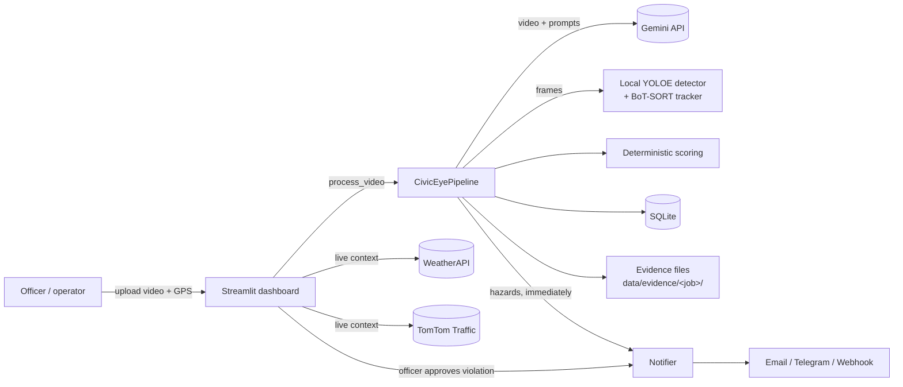
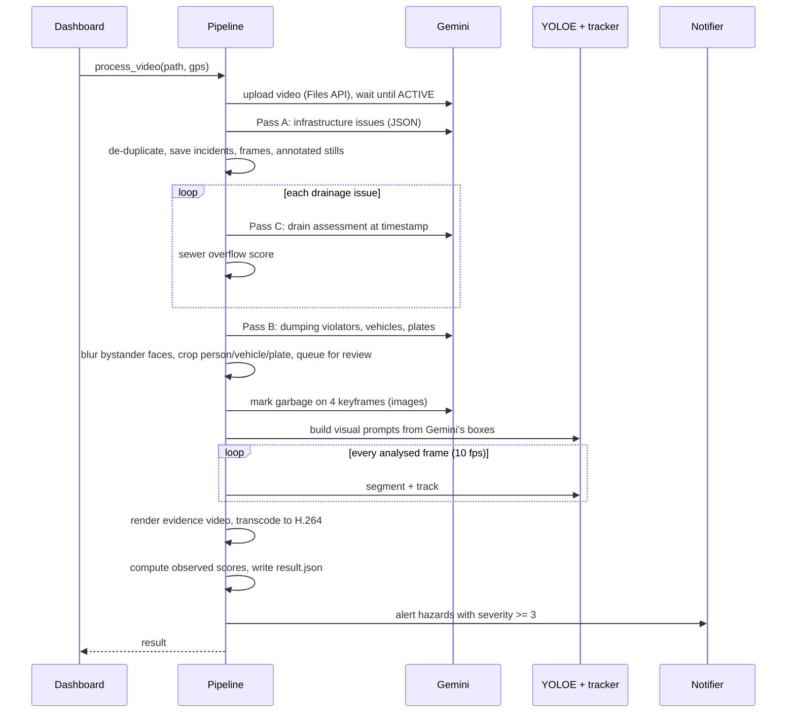
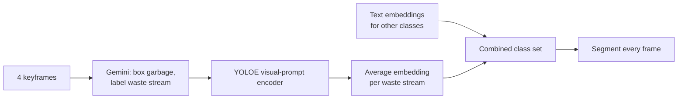
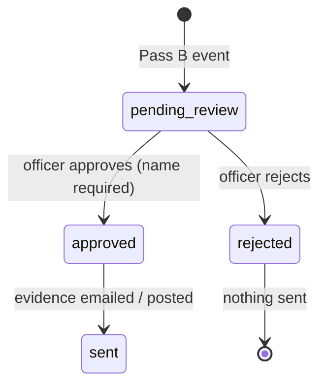
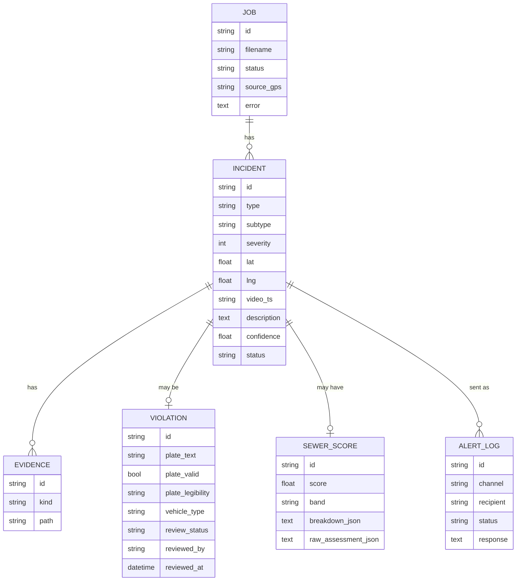

# Architecture

How FloodGuard (codename CivicEye) turns an uploaded street or CCTV video into scored, evidence-backed civic incidents, and how those incidents reach the municipal corporation.

For the build history and problems along the way, see [PROBLEMS_AND_FIXES.md](PROBLEMS_AND_FIXES.md). For what is done and what is next, see [PLAN.md](PLAN.md). Models and libraries are listed in [TECH_STACK_AND_MODELS.md](TECH_STACK_AND_MODELS.md).

---

## 1. Design principles

These rules come from [`AGENTS.md`](../AGENTS.md) and from problems found while building ([PROBLEMS_AND_FIXES.md](PROBLEMS_AND_FIXES.md)).

1. **Two kinds of model, each doing what it is good at.** Gemini (a vision-language model) decides *what is happening* in a clip: is that a blocked drain, is someone dumping waste, how full is the drain. A local segmentation model (YOLOE) decides *where each thing is in every frame*. Neither is asked to do the other's job.
2. **The VLM never outputs a score.** Gemini returns categorical observations (`water_level: "flowing_over"`, `trash_inside: "heavy"`). Scores are computed by deterministic Python in [`app/core/scoring.py`](../app/core/scoring.py), so they are reproducible and explainable.
3. **Never invent results.** If a step fails (Gemini unreachable, quota exhausted, detector crash), the job fails or the field is reported as *not measured*. No fallback is allowed to fabricate detections.
4. **People are never reported automatically.** Dumping violations (photo of a person, vehicle, number plate) wait in a review queue until a named officer approves them. Infrastructure hazards (drains, garbage, potholes) are sent immediately.
5. **Every Gemini call goes through one client** ([`gemini_client.py`](../app/core/gemini_client.py)) with retries, model fallback and JSON-schema validation. Prompts live in [`prompts.py`](../app/core/prompts.py), response schemas in [`schemas.py`](../app/core/schemas.py).

---

## 2. System overview



| Layer | Code | Responsibility |
|---|---|---|
| Dashboard | `app/ui/` | Upload, results, officer review, crew dispatch, maps, analytics |
| Pipeline | `app/core/pipeline.py` | Orchestrates one video end to end |
| VLM client | `app/core/gemini_client.py`, `prompts.py`, `schemas.py` | Gemini calls with structured JSON output |
| Local detector | `app/core/detector.py`, `civiceye_botsort.yaml` | Per-frame segmentation, tracking, garbage measurement |
| Evidence | `app/core/evidence.py` | Frame extraction, crops, face blurring, annotated video |
| Scoring | `app/core/scoring.py` | Sewer, drainage, garbage, composite and city ranking scores |
| De-duplication | `app/core/dedupe.py` | Merges repeat sightings of the same issue |
| Plates | `app/core/plates.py` | Indian number-plate format validation |
| Alerts | `app/notify/alerts.py` | Email, Telegram, webhook; every attempt logged |
| Storage | `app/db/` | SQLAlchemy models, SQLite session |
| Config | `app/config.py`, `.env` | All settings and keys, never hard-coded |

---

## 3. The video pipeline

`CivicEyePipeline.process_video()` runs these steps in order for one video. Times are measured on the development laptop (CPU only) for an 11-second 478x850 phone clip.



| Step | What happens | Gemini requests |
|---|---|---|
| 1. Upload | Video goes to the Gemini Files API; the client polls until it is `ACTIVE` (timeout 300 s). | upload only |
| 2. Pass A | Lists every distinct issue: garbage, drainage, road, other. Each has a category, subtype, severity 1-5, time range, best frame, bounding box, description and confidence. | 1 |
| 3. De-duplicate | Sightings within 10 s whose boxes overlap (IoU >= 0.4) are merged; the most confident one is kept. | 0 |
| 4. Incidents | Each issue becomes an `Incident` row with a raw still and an annotated still. | 0 |
| 5. Pass C | For each drainage issue, Gemini assesses water level, trash inside and near the drain, grating, cover and wet conditions at that timestamp. | 1 per drain |
| 6. Pass B | Finds people dumping waste: timestamp, person/garbage/vehicle/plate boxes, plate text and legibility. Bystander faces are blurred; person, vehicle and plate crops are saved; plate format is validated. Status is `pending_review`. | 1 |
| 7. Garbage examples | Up to 4 keyframes are extracted (Gemini's garbage/drain best frames first, then evenly spaced). Gemini boxes every garbage region on them and labels its waste stream. | 1 |
| 8. Detection | YOLOE segments every analysed frame; countable objects are tracked; garbage is measured as area. | 0 |
| 9. Evidence video | Masks, track IDs and Gemini findings are drawn on every frame and the video is transcoded to H.264. | 0 |
| 10. Scores | Deterministic scores from observed evidence only (Section 6). | 0 |
| 11. Alerts | Hazards at or above `ALERT_MIN_SEVERITY` (default 3) are sent on every configured channel. | 0 |

A typical video uses **about 5 Gemini requests** (more if several drains are found). End-to-end time for the 11-second clip was **95 to 116 seconds**, about 45 of which is local detection.

### Failure behaviour

| Failure | Behaviour |
|---|---|
| Upload or Pass A fails | Job is marked `failed` with the error. Nothing is invented. |
| Pass B or Pass C fails | Logged and shown in progress; the rest of the job continues. |
| Garbage-example request fails | Detector runs without garbage classes; garbage is reported as *not measured*, and the garbage score falls back to Gemini's severity rating. |
| Local detector crashes | Evidence video is rendered with Gemini findings only; `objects` is `null`. |
| No alert channel configured | Progress says so; nothing is claimed as sent. |
| A model returns 429 (quota) or 404 | The client moves straight to the next model in `FALLBACK_MODELS`. 503s are retried with backoff first. |

---

## 4. Gemini usage

| Call | Input | Output schema | Purpose |
|---|---|---|---|
| Pass A | whole video | `InfraAnalysisResponse` | Infrastructure issues |
| Pass B | whole video | `ViolatorAnalysisResponse` | Dumping events, vehicles, plates |
| Pass C | whole video + timestamp | `SewerAssessment` | Drain condition facts |
| Garbage examples | up to 4 JPEG frames (max side 1024 px) | `GarbageExemplarResponse` | Boxes and waste streams that teach the local detector |

All calls share one system instruction (`SYSTEM_CONTEXT`) describing an Indian municipal inspector: open nullahs, missing manhole covers, roadside garbage points, auto-rickshaws, monsoon waterlogging. It also tells the model to lower confidence instead of guessing, and to return `null` for an illegible plate rather than invent one. The violator prompt forbids describing anything about a person except clothing colour and actions.

Requests use `temperature=0.1`, `response_mime_type="application/json"` and a Pydantic `response_schema`, so every response is validated before use. Bounding boxes are normalised to 0-1000 (`[ymin, xmin, ymax, xmax]`).

**Model selection.** `GEMINI_MODEL` (currently `gemini-3.8-flash`) is tried first, then `FALLBACK_MODELS` in order: `gemini-3.8-flash`, `gemini-3.7-flash`, `gemini-3.6-flash`, `gemini-3.5-flash`, `gemini-3-flash-preview`, `gemini-flash-latest`, `gemini-3.5-flash-lite`, `gemini-3.1-flash-lite`. The free tier allows 20 requests per model per day, so the chain matters in practice (see [Problem 12](PROBLEMS_AND_FIXES.md#12-gemini-free-tier-quota-ran-out-repeatedly)).

---

## 5. Local detector

### Why it exists

Gemini returns one bounding box per issue, on one frame. An evidence video needs every object located in every frame. The original code faked this; the detector does it for real.

### Model

**YOLOE-26s-seg** from Ultralytics: an open-vocabulary YOLO segmentation model that can detect classes described by text, or by example boxes ("visual prompts"). It runs on CPU at about 0.3 s per frame at 640 px.

### Classes

| Source | Classes | Category |
|---|---|---|
| Text prompts (baked into the model once) | person | person |
| | motorcycle, car, auto rickshaw, truck, bus, bicycle | vehicle |
| | manhole, open drain, storm drain grate, stagnant water puddle | drainage |
| | pothole | road |
| | garbage bin | bin |
| | license plate | plate |
| Visual prompts (learned per video from Gemini's boxes) | plastic waste, paper waste, organic waste, construction debris, e-waste, mixed garbage | garbage |

Garbage is deliberately **not** text-prompted. On real footage the text prompts barely registered garbage (best score 7%) and labelled a brick wall as construction debris (Problem 18).

### Teaching garbage per video



1. Gemini boxes garbage on the keyframes. Boxes are scaled to pixels on the original frames.
2. For each keyframe, YOLOE's visual-prompt predictor turns the boxes into one embedding per waste stream.
3. Embeddings for the same waste stream across keyframes are averaged and normalised.
4. The model's classes are set to the text classes plus one garbage class per waste stream that appeared.

### Per-frame processing

- Frames are analysed at `DETECTOR_FPS` (default 10); skipped frames reuse the last detections for drawing.
- Confidence thresholds are per class: 0.25 for text classes, 0.10 for garbage classes (visual-prompt scores run lower).
- Countable objects (people, vehicles, drains, potholes, plates, bins) go to **BoT-SORT** with sparse optical-flow camera-motion compensation, which helps with handheld and phone footage. Settings are in [`civiceye_botsort.yaml`](../app/core/civiceye_botsort.yaml).
- Garbage is **not tracked**. Heaps have no stable boundary between frames, so tracking them produced a new ID almost every frame (Problem 20). Garbage is measured as area instead.
- Mask outlines are computed from the mask bitmap with every separate piece kept as its own contour (Problem 22).

### Video-level summary (`objects` in `result.json`)

| Field | Meaning |
|---|---|
| `objects` | Tracked countable objects seen in at least `min_frames` analysed frames (0.5 s at 10 fps); shorter tracks are treated as flicker |
| `counts_by_category` | Number of such tracks per category (can overcount people when the camera pans) |
| `peak_in_frame` | Most objects of each category visible in one frame (robust to ID switches) |
| `garbage_measured` | `false` when Gemini could not supply garbage examples |
| `garbage_coverage` | 90th percentile, over analysed frames, of the share of the frame covered by the union of garbage masks |
| `max_garbage_coverage` | Largest single-frame coverage |
| `garbage_frame_fraction` | Share of analysed frames with any garbage (> 0.5%) |
| `waste_breakdown` | Share of total garbage area per waste stream (sums to 1) |
| `timeline` | Per-second counts per category plus `garbage_coverage` |

Coverage is computed on a 160-px raster so overlapping masks are not double-counted.

---

## 6. Scoring

All scores are 0-100 and banded: **Critical** >= 80, **High** >= 60, **Watch** >= 30, otherwise **Low**.

### Sewer overflow score (per drain, Pass C)

```
score = 100 x ( 0.35 x water + 0.25 x trash_inside + 0.15 x trash_near
              + 0.10 x inlet_blocked + 0.10 x hazard + 0.05 x wet )
```

Water level maps none 0, damp 0.2, pooling 0.5, flowing_over 0.85, gushing 1.0. Trash inside maps none 0 to fully_blocked 1.0; trash near maps none 0 to heavy 1.0. If water is `flowing_over` or `gushing`, the score is floored at 70. Weights are configurable in `.env`.

### Video scores (`compute_observed_hazard_scores`)

| Score | Inputs | When not observed |
|---|---|---|
| Drainage | Worst Pass C assessment: water 35, grating blocked 25, water on road 20, broken cover 15, wet weather 5 (floor 70 when overflowing) | `null`, shown as "Not assessed" |
| Garbage | Trash inside drain 45 + trash near drain 25 + heap volume 20 + dumping seen 10 (floor 75 when fully blocked) | 0 if nothing observed at all |
| Composite | 0.42 x drainage + 0.38 x garbage (+ 0.20 x water depth, always 0 because depth cannot be measured from video) | |

Heap volume comes from detector coverage: none (0), light (< 2%), moderate (< 8%), heavy (< 20%), massive. If garbage was not measured, it falls back to Gemini's garbage severity (1-2 light, 3 moderate, 4 heavy, 5 massive). `score_sources` in `result.json` records which input was used.

### City ranking (dashboard)

`rank_locations_by_all_attributes` ranks the 53 monitored Pune locations on rainfall (WeatherAPI), traffic congestion (TomTom), conduit saturation and blockage. The location list itself is seed data (Section 9).

---

## 7. Violations and privacy



- Every Pass B event creates an `Incident` (`dumping_violation`, status `pending_review`) and a `Violation` row.
- Evidence: full frame with bystander faces blurred (OpenCV Haar cascade; faces inside the violator's box are kept), plus person, vehicle and plate crops.
- Plates are checked against standard (`MH12QX4821`) and Bharat-series (`22BH1234AA`) formats; the result is shown to the reviewer, never used to auto-approve.
- Approve or reject requires the officer's name and writes an `AuditLog` row. Only approval sends anything.

---

## 8. Alerts

[`app/notify/alerts.py`](../app/notify/alerts.py) sends one incident to every configured channel and logs each attempt in `alert_logs` (`sent` or `failed`, with the response or error).

| Channel | Configured by | What is sent |
|---|---|---|
| Email | `SMTP_HOST`, `SMTP_PORT`, `SMTP_USER`, `SMTP_PASS`, `ALERT_EMAIL_RECIPIENT` | Text report + image attachments (STARTTLS on 587, SSL on 465) |
| Telegram | `TELEGRAM_BOT_TOKEN`, `TELEGRAM_CHAT_ID` | Message, then one photo per evidence image |
| Webhook | `WEBHOOK_URL` | JSON payload with base64-encoded evidence images |

Hazards attach the annotated still. Violations attach the scene, person, vehicle and plate images, plus plate text, legibility, format check and the approving officer. A failed channel never fails the job.

---

## 9. Dashboard

Streamlit app at [`app/ui/dashboard.py`](../app/ui/dashboard.py), using `st.navigation` so each page has a URL.

| Page | URL | Content | Data source |
|---|---|---|---|
| Overview | `/` | City risk summary, corridor ranking, map, forecasts | Seed locations + live weather/traffic |
| Risk map | `/risk-map` | Locations by zone, severity, camera | Seed locations |
| CCTV analysis | `/cctv` | Video upload, analysis progress, results (evidence video, scores, objects, waste share, timeline, Gemini findings) | **Real**: pipeline output |
| Priority queue | `/queue` | Officer review of dumping violations; open incidents and crew dispatch | **Real** violations from the database; open incidents and crews are seed data |
| Analytics | `/analytics` | Rainfall correlation, ward comparison, printable report, exports | Seed data + live weather |

The seed data in [`app/ui/pune_data.py`](../app/ui/pune_data.py) (53 locations, camera list, open incidents, crews) is demonstration data, not a live municipal feed. Pipeline output is real.

Theme: light canvas with tokens in [`styles.py`](../app/ui/components/styles.py), one teal accent, Space Grotesk / Inter / JetBrains Mono, inline SVG icons, and a fixed top bar with a pop-up command-palette menu.

---

## 10. Data model



`AUDIT_LOG` (user, action, entity, entity_id, timestamp) records officer actions. Evidence `kind` is one of `frame`, `annotated`, `crop_person`, `crop_vehicle`, `crop_plate`, `annotated_video`.

### Files on disk

```
data/
  civiceye.db                 SQLite database
  uploads/                    uploaded videos
  evidence/<job_id>/
    incident_<id>_raw.jpg     still at Gemini's best frame
    incident_<id>_annotated.jpg
    violation_<id>_frame.jpg  bystanders blurred
    violation_<id>_crop_{person,vehicle,plate}.jpg
    surveillance_<job>_annotated.mp4
    result.json               scores, sources, object summary
  models/                     YOLOE weights and the baked CivicEye model
```

All of `data/` except the `.gitkeep` files is git-ignored.

---

## 11. Configuration

All settings are in [`app/config.py`](../app/config.py) and can be overridden in `.env`. Relative paths in `.env` resolve against the project root.

| Setting | Default | Purpose |
|---|---|---|
| `GEMINI_API_KEY` | (required) | Gemini access |
| `GEMINI_MODEL` | `gemini-3-flash-preview` (`.env` uses `gemini-3.8-flash`) | First model tried |
| `DETECTOR_ENABLED` | `true` | Run the local detector |
| `DETECTOR_MODEL` | `yoloe-26s-seg.pt` | Base segmentation weights |
| `DETECTOR_CONF` / `DETECTOR_VP_CONF` | 0.25 / 0.10 | Thresholds for text / garbage classes |
| `DETECTOR_FPS` | 10 | Analysed frames per second of video |
| `DETECTOR_EXEMPLAR_FRAMES` | 4 | Frames Gemini marks garbage on |
| `DETECTOR_IMGSZ` | 640 | Inference size |
| `ALERT_MIN_SEVERITY` | 3 | Hazards at or above this alert immediately |
| `WEIGHT_*`, `SEWER_OVERFLOW_FLOOR` | see Section 6 | Sewer score weights |
| SMTP / Telegram / webhook | empty | Alert channels |
| `WEATHER_API_KEY`, `TOMTOM_API_KEY` | empty | Live context on the dashboard |
